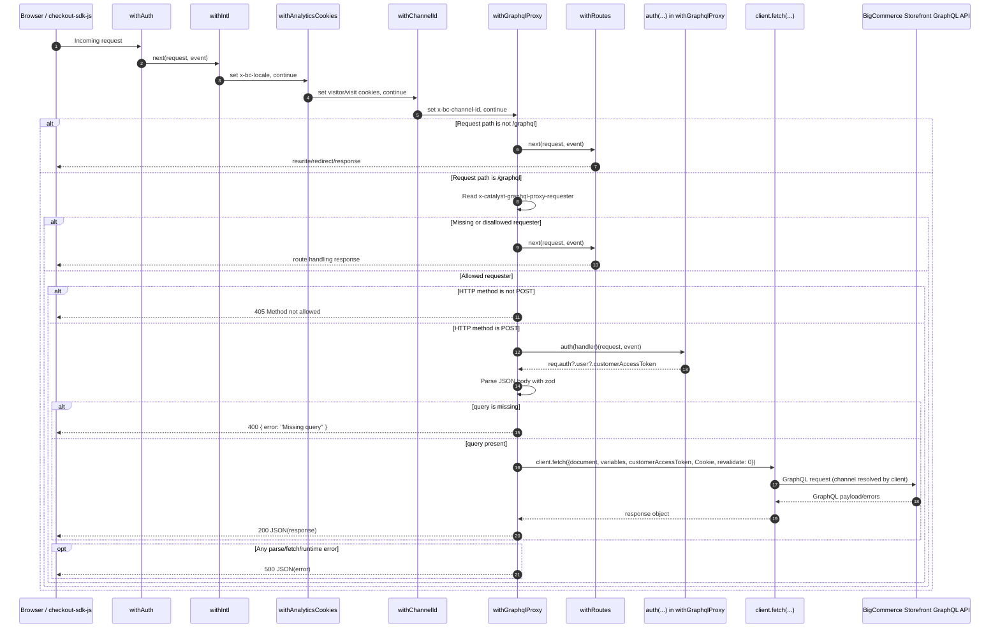

# PR #2825 Analysis: GraphQL Proxy Middleware

This document analyzes [bigcommerce/catalyst#2825](https://github.com/bigcommerce/catalyst/pull/2825) and models the request flow introduced by `withGraphqlProxy`.

## Summary of behavior changes

- Adds a new middleware: `withGraphqlProxy` (`core/middlewares/with-graphql-proxy.ts`).
- Inserts it in `core/middleware.ts` after `withChannelId` and before `withRoutes`.
- Intercepts only requests to `/graphql` with an allowed requester header.
- Proxies valid GraphQL POST payloads through the existing Catalyst GraphQL client.
- Preserves browser cookie context and passes optional customer auth token to Storefront API requests.
- Falls through to `withRoutes` when request path or requester header does not match proxy criteria.

## Middleware order after PR #2825

1. `withAuth`
2. `withIntl`
3. `withAnalyticsCookies`
4. `withChannelId`
5. `withGraphqlProxy` (new)
6. `withRoutes`

## Sequence diagram

## Key implementation notes

- **Guard rails:** proxying is constrained by both route (`/graphql`) and requester allowlist (`x-catalyst-graphql-proxy-requester`).
- **Auth context:** middleware wraps proxy handling in `auth(...)` to obtain `customerAccessToken` when available.
- **Channel + locale continuity:** placing proxy middleware after `withChannelId` ensures channel context is resolved before API calls.
- **Cookie forwarding:** original request cookies are forwarded to emulate browser-originated Storefront API behavior.
- **No-cache fetch option:** `next: { revalidate: 0 }` is used for proxy requests to avoid stale responses.
